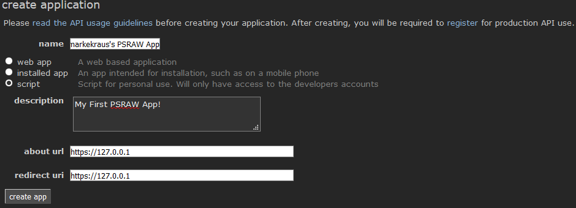
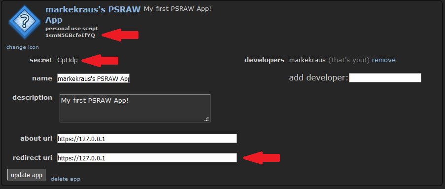

# Quicker Quickstart Example for 2.0

In PSRAW 2.0, the `Connect-Reddit` command was introduced to make getting up and running in PSRAW even easier. This is great for One-Off projects or just messing around on the console. It streamlines the entire OAuth Process to a single command. You still need to [register a Script Application on Reddit](#register-a-script-application-on-reddit) before you can use PSRAW. `Connect-Reddit` will prompt you for the Client ID, Client Secret, Redirect URI, your Reddit Username, and Reddit Password. It will then take care of creating a `RedditApplication` and requesting an OAuth Token.

The following code will authenticate you and retrieve your reddit user details.

```powershell
Import-Module PSRAW
Connect-Reddit
irr https://oauth.reddit.com/api/v1/me |
    Select-Object -ExpandProperty ContentObject
Export-RedditOAuthToken C:\PSRAW\MyApp.xml
```

The `irr` alias for `Invoke-RedditRequest` has been added to work similar to what `irw` does for `Invoke-WebRequest`. PSRAW now also sets a default OAuth access token for the duration of your PowerShell session so you no longer need to explicitly pass the access token. But, if you are working with multiple identities, you can still create/request them manually and pass them to the various commands that accept them.

With the above example you have exported your OAuth Access token to `C:\PSRAW\MyApp.xml`. Now you can import it in future sessions and skip the `Connect-Reddit` step.

```powershell
Import-Module PSRAW
Import-RedditOAuthToken C:\PSRAW\MyApp.xml
irr https://oauth.reddit.com/api/v1/me |
    Select-Object -ExpandProperty ContentObject
```

`Import-RedditOAuthToken` now sets the imported OAuth Token as the default token for the session. No need to worry about the stored OAuth Token being expired as `Invoke-RedditRequest` manages your OAuth toke lifecycle for you with every request you make to the API.


# Traditional Quickstart Example

This example will demonstrate how to create a Script based Reddit app, authenticate it, and Retrieve your inbox messages.

- [Quickstart Example](#quickstart-example)
    - [Register a Script Application on Reddit](#register-a-script-application-on-reddit)
    - [Install and Import PSRAW](#install-and-import-psraw)
    - [Create and Export a `RedditApplication`](#create-and-export-a-redditapplication)
    - [Request and Export and `RedditOAuthToken`](#request-and-export-and-redditoauthtoken)
    - [Retrieve Inbox Messages](#retrieve-inbox-messages)
    - [Full Code](#full-code)

## Register a Script Application on Reddit

1. Log into Reddit
1. Navigate to [https://ssl.reddit.com/prefs/apps](https://ssl.reddit.com/prefs/apps)
1. Click the `create app` or `create another app` button
1. Enter a name (e.g. "(Reddit Username)'s PSRAW App")
1. Choose the `Script` radio button
1. Enter a description (e.g. "My first PSRAW App!")
1. In the about url box enter `https://127.0.0.1`
1. In the redirect URI box enter `https://127.0.0.1`
1. Click the `create app` button



Th application has been registered. You will need to note your Client ID (Listed below the application's name), the Client Secret (Labeled as `secret`), and the redirect uri. These will be used to create the `RedditApplication` object in a later section. Keep your client secret safe. It should be treated like a password.



## Install and Import PSRAW 
In a PowerShell console run the following

```powershell
Install-Module -Name PSRAW -Scope CurrentUser
Import-Module PSRAW
```

> **NOTE**
>
> PSRAW requires PowerShell v5 or later.

## Create and Export a `RedditApplication`
Run the following  code. When creating `$ClientCredential` the username will bee your Client ID and the password will be your client secret. When creating the `$UserCredential`, the username and password will be your Reddit username and password. The `$RedirectUri` will be the same redirect URI configured when you registered the application.

You will need to modify `$UserAgent` to be in alignment with [Reddit's API Rules](https://github.com/reddit/reddit/wiki/API#rules).

```powershell
$ClientCredential = Get-Credential
$UserCredential = Get-Credential
$RedirectUri = 'https://127.0.0.1'
$AppExportPath = 'C:\PSRAW\MyApp.xml'
$UserAgent = 'windows:markekraus-PSRAW:v0.0.0.1 (by /u/markekraus)'
$Params = @{
    Script           = $True
    Name             = "markekraus's PSRAW App"
    Description      = 'My first PSRAW App!'
    ClientCredential = $ClientCredential
    UserCredential   = $UserCredential
    RedirectUri      = $RedirectUri
    UserAgent        = $UserAgent 
}
$RedditApp = New-RedditApplication @Params
$RedditApp | Export-RedditApplication -Path $AppExportPath
```

> **NOTE**
>
> Exporting the application is optional. This will allow you to use the application again later in another script if you so require.

## Request and Export and `RedditOAuthToken`
Now that we have an application defined, we need to authorize this application. Since we created this as a `Script` app, the app can be used to login as the developer who created the app using the `Script` grant flow. This will authenticated the app without prompting us to authorize the app in the GUI browser. 

For more information about the available grant flows see [Request-RedditOAuthToken](../Module/Request-RedditOAuthToken.md).

```powershell
$TokenExportPath = 'C:\PSRAW\MyToken.xml'

$Token = $RedditApp | Request-RedditOAuthToken -Script
$Token | Export-RedditOAuthToken -Path $TokenExportPath
```

> **NOTE**
>
> Exporting the Access Token is optional. This will allow you to import the token later in another script (especially an automated bot). You only have to perform the above step once. After you have a `RedditOAuthToken` it can be used repeatedly until you change your reddit password or the app is deleted from Reddit.

## Retrieve Inbox Messages
Now that the application has been authorized and we have an Access Token, we can make authenticated calls to the Reddit API. The complete list of API Endpoints is available [here](https://www.reddit.com/dev/api/).

```powershell
$Uri = 'https://oauth.reddit.com/message/inbox'
$Response = $Token | Invoke-RedditRequest -Uri $Uri
$Messages = $response.ContentObject.data.children.data
```

The `$Messages` object will contain a collection of messages form your inbox. If you have a large inbox, this will only be a subset. You will need to make use of the Reddit API's [listing](https://www.reddit.com/dev/api/#listings) pagination features to retrieve them all.

> **NOTE**
>
> As this is the initial core functionality release, no wrapper functions have yet been added. Eventually a command such as `Get-RedditInboxMessage` will exist to make it easy to retrieve messages and will likely be returned as a collection of `RedditMessage` objects.

## Full Code

Here is the complete code:

```powershell
Install-Module -Name PSRAW -Scope CurrentUser
Import-Module PSRAW

$ClientCredential = Get-Credential
$UserCredential = Get-Credential
$RedirectUri = 'https://127.0.0.1'
$AppExportPath = 'C:\PSRAW\MyApp.xml'
$UserAgent = 'windows:markekraus-PSRAW:v0.0.0.1 (by /u/markekraus)'

$Params = @{
    Script           = $True
    Name             = "markekraus's PSRAW App"
    Description      = 'My first PSRAW App!'
    ClientCredential = $ClientCredential
    UserCredential   = $UserCredential
    RedirectUri      = $RedirectUri
    UserAgent        = $UserAgent 
}
$RedditApp = New-RedditApplication @Params
$RedditApp | Export-RedditApplication -Path $AppExportPath

$TokenExportPath = 'C:\PSRAW\MyToken.xml'

$Token = $RedditApp | Request-RedditOAuthToken -Script
$Token | Export-RedditOAuthToken -Path $TokenExportPath

$Uri = 'https://oauth.reddit.com/message/inbox'
$Response = $Token | Invoke-RedditRequest -Uri $Uri
$Messages = $response.ContentObject.data.children.data
```